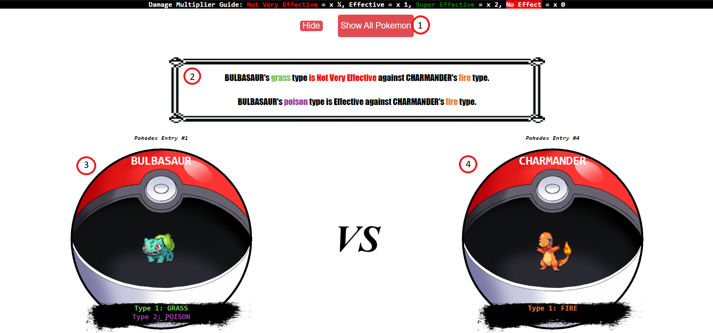

# PokeComparer

PokeComparer is a Single Page Application (SPA) written in Javascript/HTML/CSS that compares two pokemon for type effectiveness.

## Description

PokeComparer takes one pokemon from the first generation pokedex and compares it to another pokemon. When the application first loads you will see display card information showing all 151 pokemon with their Pokedex Entry #, name, appearance and types listed. Using this information you can input two pokemon to compare using the form at the top of the application. Then, PokeComparer will take the types of the first pokemon (displayed on the left) and compare it to the types of the second pokemon (displayed on the right) for type effectiveness. Type effectiveness refers to how much damage one pokemon type does against another pokemon type. It then displays whether each of the first pokemon's types are effective, super effective, not very effective or has no effect on each of the second pokemon's types. A guide is also displayed explaining the damage multiplier for each level of type effectiveness. 

## Installation

Navigate to https://github.com/sama-cc/Phase-1-Project and click on the green <> CODE button. Choose "Download ZIP" and download the zip file. Once downloaded, unzip the file and then open the file "index.html" in your browser.

## Usage

Upon loading the application screen the following will be displayed:

1. The "Choose Pokemon to Compare" button - This button reveals the input form for selecting pokemon to compare. Upon clicking this button it will become the "Hide" button.

2. The 1st Generation Pokemon Collection - This is a collection of display cards showing each pokemon's Pokedex Entry #, name, appearance and types. The collection is in ascending order based on Pokedex Entry #.

Upon clicking on the "Choose Pokemon to Compare" button the following will be displayed:

1. Pokemon 1 Entry Box - This box can use either a pokemon's name or Pokedex Entry # to submit as the first pokemon to compare.

2. Pokemon 2 Entry Box - This box can use either a pokemon's name or Pokedex Entry # to submit as the second pokemon to compare.

3. The "Compare Pokemon" button - This button is used to submit the two pokemon to compare once a pokemon name or Pokedex Entry # has been input into both Entry Boxes. If a valid pokemon name or Pokedex # has not been entered into either box then an error will be displayed for one or both of the boxes. For more help, please see the FAQ or Support sections.

4. The "Hide" button - This button will hide the input form. It becomes the "Choose Pokemon to Compare" button once the form is hidden.

Upon submitting the form the following will be displayed:

1. The "Show All Pokemon" button - This button makes the application return to the Pokemon Collection screen.

2. The Comparison Data Statements - In the centered text box below the form and Damage Multiplier Guide you will find comparison data statements for each type interaction in the following format:

    - "POKEMON 1's type is "effectiveness" against POKEMON 2's type."

    - "Effectiveness" refers to one of the effectiveness levels from the table above. There will be a statement for each type interaction. There are four possible comparison interactions listed below:

        | Comparison Statements                                                                        |
        | ----------------------------------------------------------------------- |
        | POKEMON 1's Type 1 vs POKEMON 2's Type 1.                               |
        | POKEMON 1's Type 1 vs POKEMON 2's Type 2 (if available).                |
        | POKEMON 1's Type 2 (if available) vs POKEMON 2's Type 1.                |
        | POKEMON 1's Type 2 (if available) vs POKEMON 2's Type 2 (if available). |

3. Pokemon 1 Display Card - A display card that shows Pokemon 1's Pokedex Entry #, name, appearance and types.

4. Pokemon 2 Display Card - A display card that shows Pokemon 2's Pokedex Entry #, name, appearance and types.

5. Damage Multiplier Guide - This guide shows the damage multiplier for each level of type effectiveness. (not marked in image)
    - The type effectiveness levels are as follows:

        | Level              | DMG Multiplier  |
        | ------------------ | --------------- |
        | Effective          | x 1             |
        | Super Effective    | x 2             |
        | Not Very Effective | x 1/2           |
        | No Effect          | x 0             |   

Another comparison can be made by inputting pokemon into the Entry Boxes and clicking on the "Compare" button again. The Pokemon Collection can be shown again by clicking the "Show All Pokemon Button" if needed as a reference.

## FAQ

- Q. When I input a pokemon's name or Pokedex Entry # into the Entry Box I get the following error. "Pokemon (1 or 2) was left blank or is not a valid Pokemon. Please check your spelling."

    A. This error happens when a pokemon's name is misspelled or does not refer to a valid first generation pokemon. This can also be caused if the Pokedex Entry # is not a valid Pokedex Entry # (above 151).

- Q. Can I input pokemon from another generation?

    A. Only Generation 1 is supported at this time.

- Q. I noticed information that is innacurate. Can you please fix it?

    A. Please contact me using the email listed in the Support section.

- Q. I am experiencing a bug. Can I get help?

    A. Please contact me using the email listed in the Support section.

## Roadmap

- Make the pokemon display cards clickable to select which pokemon to compare.
- Make a drop-down menu to select which pokemon to compare.
- Make a button to switch pokemon 1 (left) and pokemon 2 (right).
- Display type effectiveness for both pokemon 1 vs pokemon 2 as well as pokemon 2 vs pokemon 1.
- Add support for other generations of the pokedex.
- Add a pokemon type Weakness and Strength chart.

## Support

If you have any questions regarding how PokeComparer is used or encounter any issues please feel free to contact me using the contact information below.

Email: sam.camhi@gmail.com
## Contributing

Pull requests are welcome. For major changes, please open an issue first
to discuss what you would like to change.

## Credit

Below is a list of materials that I did not create and must give credit:

1. "https://www.pngall.com/wp-content/uploads/4/Pokemon-Pokeball-Transparent.png" - Open Pokeball Image
2. "https://media-s3-us-east-1.ceros.com/hype-beast/images/2018/07/13/2fd783a5482aff60e6ae7aa327f2c9c9/text-box.png?imageOpt=1&fit=bounds&width=593" - Pokemon Textbox
3. "https://assets.stickpng.com/images/594191895eb5d45f10e35b25.png" - Brush Stroke Image
4. "https://www.pngmart.com/files/2/Pokeball-Transparent-PNG.png" - Closed Pokeball Image

## License

[MIT](https://choosealicense.com/licenses/mit/)